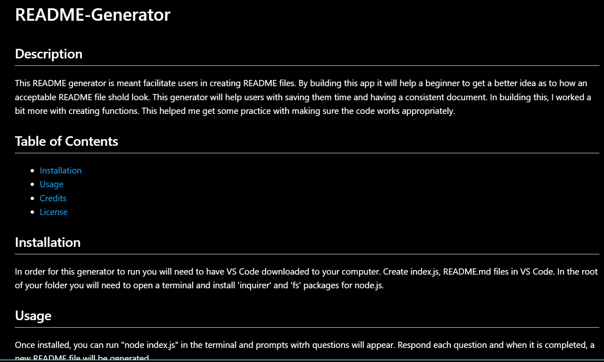

# README-Generator

## Description

This README generator is meant facilitate users in creating README files. By building this app it will help a beginner to get a better idea as to how an acceptable README file shold look. This generator will help users with saving them time and having a consistent document. In building this, I worked a bit more with creating functions. This helped me get some practice with making sure the code works appropriately. 

## Table of Contents

- [Installation](#installation)
- [Usage](#usage)
- [Credits](#credits)
- [License](#license)

## Installation

In order for this generator to run you will need to have VS Code downloaded to your computer. Create index.js, README.md files in VS Code. In the root of your folder you will need to open a terminal and install 'inquirer' and 'fs' packages for node.js. 

## Usage
Once installed, you can run "node index.js" in the terminal and prompts with questions will appear. 

Respond each question and when it is completed, a new README file will be generated. 

## Credits

Github link - https://github.com/Myrmecology - worked on this project with Justin Deines.

Shields.io - https://shields.io/badges - badges for licenses.

NPM - https://www.npmjs.com/ - NPM package usage

## License

MIT License

## Tests

Video demo of how to run -
[Walkthrough](https://drive.google.com/file/d/1ipF5pmfM0dG16eTPTwgJnzxAd7MYqJs6/view?usp=sharing)
